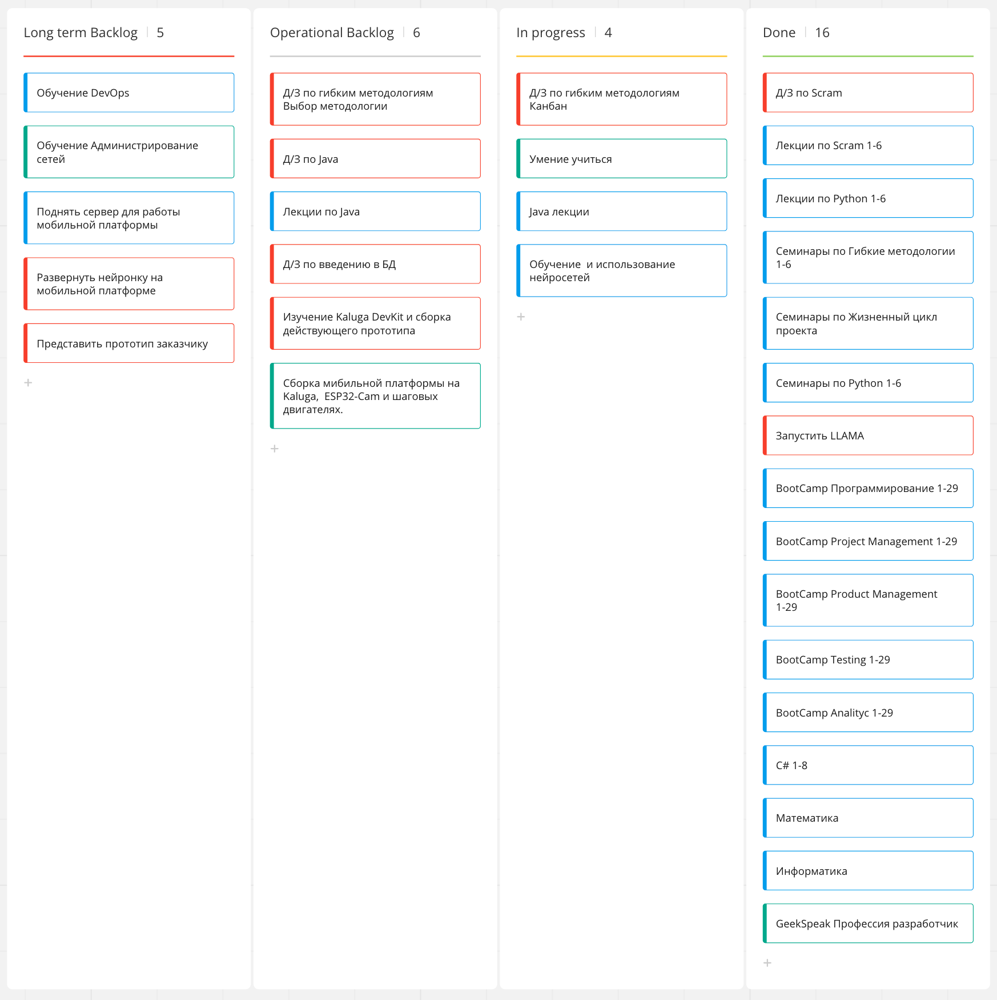

Проанализируйте свой процесс обучения и продвижение по карьере в IT.
Выделите задачи, которые стоят перед вами на месяц/квартал/год.
Ранжируйте поставленные задачи по классам обслуживания, выберите цвета для Kanban-карточек.
Определите WiP для управления потоком незавершённых задач.
Добавьте задачи, которые вы определили, на личную Kanban-доску.

Критерии для мониторинга проекта "Обучение за 50..."
| Критерий | Необходимый уровень | Фактический уровень | Необходимая коррекция |
|:-------:|
| 1. Средняя загрузка. | 

|  Таблицы     | Это                | Круто |
|--------------|:------------------:| -----:|
| столбец 3    | выровнен вправо    | $1600 |
| столбец 2    | выровнен по центру |   $12 |
| зебра-строки | прикольные         |    $1 |